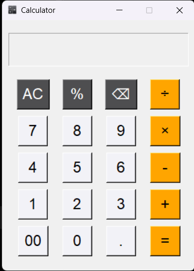

# Calculator App

A simple calculator built using Python and Tkinter.

## Features

- Addition (+)
- Subtraction (-)
- Multiplication (×)
- Division (÷)
- Clear Screen (AC)
- Backspace (⌫)
- Divide-by-zero handling
- Keyboard Enter support
- Read-only display
- Custom application icon

## Screenshot



## Requirements

- Python 3.8+ (tested on Python 3.13.5)

## Run Locally

```bash
git clone https://github.com/LokjitKundu/calculator_tkinter.git

cd calculator_tkinter

python run.py
```

## Project Structure

```text
calculator_tkinter/
│
├── assets/
│   └── calculator_icon.ico
│ 
├── screenshots/
│   └── calculator_image.png
│ 
├── app.py
│
├── run.py
│
├── LICENSE
│
├── .gitignore
│
└── README.md
```

## Author

Lokjit Kundu
